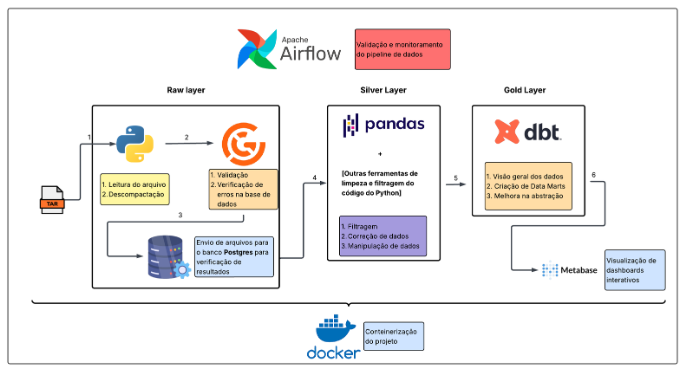
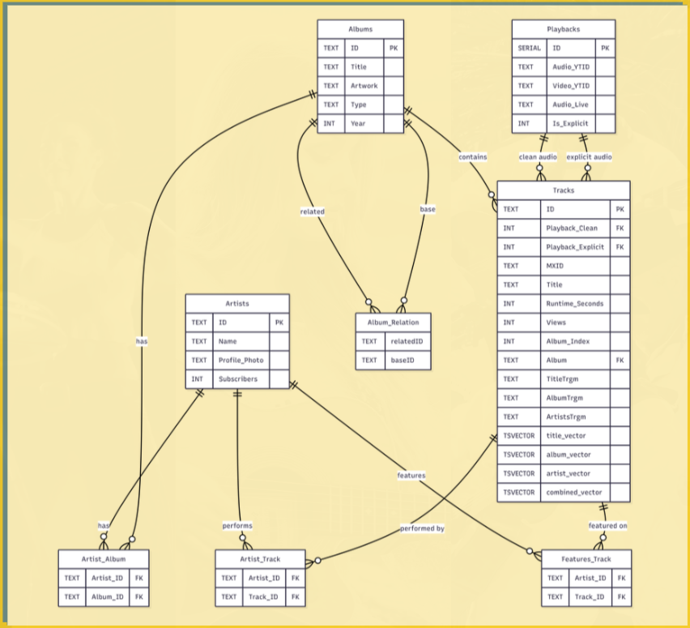

# Projeto Final - Fundamentos Engenharia de Dados  
**Tema:** Entretenimento - Agência de mídia - música

**Profº:** Wesley Lourenço Barbosa

# Integrantes - Grupo 7

- Fernando Luiz
- Igor Graseffi
- João Armandes
- Vitor Ribeiro
- Victor Lira

## Desafio do Projeto

Construção de um pipeline ELT completo, avaliando a qualidade dos dados desde a ingestão (`Raw`), passando pela transformação (`Silver`/`Gold`) até a visualização.

## Storytelling

Somos uma agência de mídia (marketing) especializada na melhoria do desempenho de artistas em promover as suas músicas nos streamings de músicas (exemplo: Spotify, Deezer, Tidal, YouTube, entre outros)

Principais questionamentos (problema de negócio):

- Qual o decay médio de playback por tipo de conteúdo  ao longo de 12 semanas?
- Músicas/ artistas populares em 2024 se mantiveram? Aqueles que começaram em 2024, ascenderam? Como?
Que combinações de features geram maior crescimento de inscritos em 60 dias?
- Existe um limiar de inscritos a partir do qual conteúdo explícito deixa de ser eficaz?

## Configurações realizadas

- DBT
- Great Expectatios

## Diagrama arquitetura

## Diagrama base de dados

## Execução do Pipeline

Em construção
  

## Vídeo de apresentação

Em construção

## Dashboards

Dashboards em construção

## Desafios Encontrados

Em construção

## Papéis e Responsabilidades

| Integrante                   | Perfil Git      | Papel / Reponsabilidade Projeto |
|--------------------------|----------|----------|
| Fernando Luiz            | Em construção  | Em construção |
| Igor Graseffi            | Em construção  | Em construção |
| João Armandes             | Em construção  | Em construção |
| Vitor Ribeiro            | Em construção  | Em construção |
| Victor Lira            | Em construção  | Em construção |

## Material de Apresentação

Em construção

## Glossário

| Nome                   | Descrição |
|--------------------------|----------|
| PostgreSQL           | Sistema de gerenciamento de banco de dados relacional (SGBD) de código aberto, robusto e avançado, utilizado para armazenar, organizar e consultar dados com alta confiabilidade, suportando SQL padrão e recursos como transações, extensões e alta escalabilidade. |
| Great
Expectations          | Framework open source para validação e qualidade de dados, que permite definir, testar e documentar regras (expectativas) para garantir a confiabilidade dos dados em pipelines e análises. |
| DBT
Expectations          | Ferramenta de transformação de dados que permite modelar, testar e documentar dados diretamente no banco, utilizando SQL e boas práticas de engenharia de dados em pipelines analíticos. |
| DBT
Expectations          | Ferramenta de transformação de dados que permite modelar, testar e documentar dados diretamente no banco, utilizando SQL e boas práticas de engenharia de dados em pipelines analíticos. |
