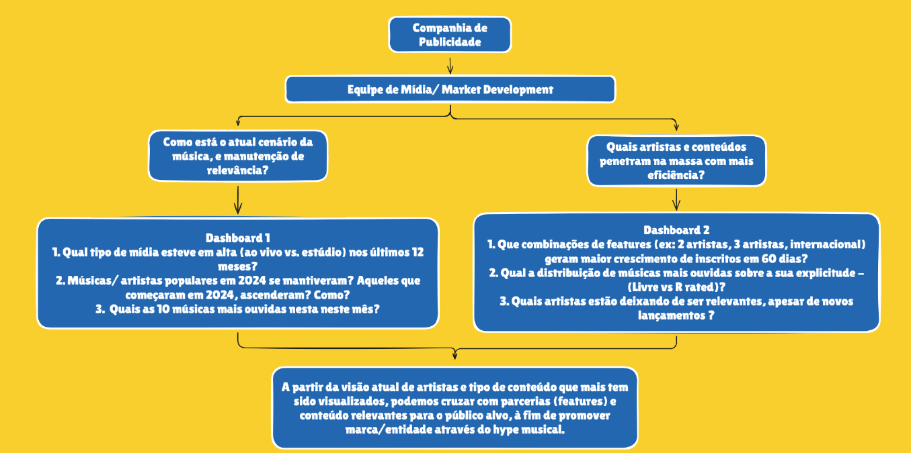

# Projeto Final - Fundamentos Engenharia de Dados  
**Tema:** Entretenimento - Agência de mídia - música

**Profº:** Wesley Lourenço Barbosa

# Integrantes - Grupo 7

- Fernando Luiz
- Igor Graseffi
- João Armandes
- Vitor Ribeiro
- Victor Lira

## Desafio do Projeto

Construção de um pipeline ELT completo, avaliando a qualidade dos dados desde a ingestão (`Raw`), passando pela transformação (`Silver`/`Gold`) até a visualização.

## Storytelling

Somos uma agência de mídia (marketing) especializada na melhoria do desempenho de artistas em promover as suas músicas nos streamings de músicas (exemplo: Spotify, Deezer, Tidal, YouTube, entre outros)

Principais questionamentos (problema de negócio):

- Qual o decay médio de playback por tipo de conteúdo  ao longo de 12 semanas?
- Músicas/ artistas populares em 2024 se mantiveram? Aqueles que começaram em 2024, ascenderam? Como?
Que combinações de features geram maior crescimento de inscritos em 60 dias?
- Existe um limiar de inscritos a partir do qual conteúdo explícito deixa de ser eficaz?

## Diagrama Storytelling

## Configurações realizadas

- DBT
- Great Expectatios

## Diagrama arquitetura

## Diagrama base de dados

## Execução do Pipeline

Em construção
  

## Vídeo de apresentação

Em construção

## Dashboards

Dashboards em construção

## Desafios Encontrados

Em construção

## Papéis e Responsabilidades

| Integrante                   | Perfil Git      | Papel / Reponsabilidade Projeto |
|--------------------------|----------|----------|
| Fernando Luiz            | [@flg29-data](https://github.com/flg29-data)  | Documentação / Apresentação / Dashboards |
| Igor Graseffi            | Em construção  | Definição do Tema / Apresentação / Storytelling / Pipeline Dados / Dashboard |
| João Armandes             | Em construção  | Diagramas Arquitetura / Pipeline de Dados / Apresentação / Base de Dados / Dashboard |
| Vitor Ribeiro            | [@TheLastAurora](https://github.com/TheLastAurora)  | Ingestão de Dados / Pipeline de Dados / Apresentação / Dashboard |
| Victor Lira            | Em construção  | Documentação / Apresentação / Vídeo Apresentação |

## Material de Apresentação

[Archives/Projeto Final G7 - Fundamentos Engenharia de Dados.pdf](https://github.com/TheLastAurora/LAB_FundamentosDados_G7/blob/15ac996eb4cb4fd6383103bc0bb523a09c656675/Archives/Projeto%20Final%20G7%20-%20Fundamentos%20Engenharia%20de%20Dados.pdf)

## Glossário

| Nome                   | Descrição |
|--------------------------|----------|
| PostgreSQL           | Sistema de gerenciamento de banco de dados relacional (SGBD) de código aberto, robusto e avançado, utilizado para armazenar, organizar e consultar dados com alta confiabilidade, suportando SQL padrão e recursos como transações, extensões e alta escalabilidade. |
| Apache Airflow          | Plataforma open source para orquestração de workflows, utilizada para agendar, monitorar e gerenciar pipelines de dados por meio de DAGs (grafos acíclicos dirigidos). |
| Great Expectations          | Framework open source para validação e qualidade de dados, que permite definir, testar e documentar regras (expectativas) para garantir a confiabilidade dos dados em pipelines e análises. |
| DBT | Ferramenta de transformação de dados que permite modelar, testar e documentar dados diretamente no banco, utilizando SQL e boas práticas de engenharia de dados em pipelines analíticos. |
| Metabase | Ferramenta open source de Business Intelligence (BI) que permite explorar dados, criar dashboards e gerar relatórios de forma simples e intuitiva, sem necessidade avançada de programação. |
| Docker | Plataforma que permite criar, empacotar e executar aplicações em containers, garantindo ambientes isolados, portáveis e consistentes entre desenvolvimento e produção. |
